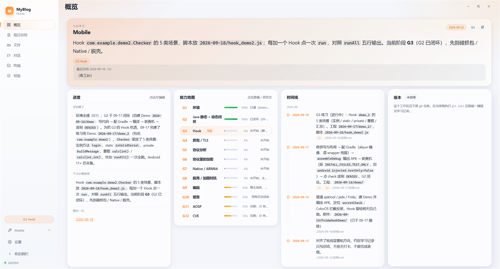
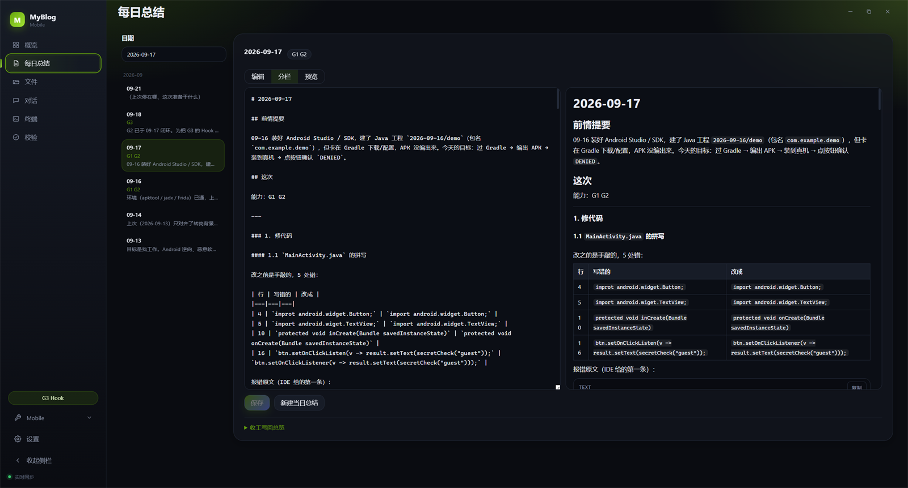

# MyBlog

[](https://github.com/Sayb1e/myblog/actions/workflows/ci.yml)
[](./LICENSE)
[](https://nodejs.org/)
[](./CHANGELOG.md)

管理「基于 markdown 的本地学习工作区」的**桌面应用（Electron）+ CLI**：解析与写回**进度总览 / 岗位能力地图 / 每日总结**，把「今天学什么、上次停在哪」变得可见、可 diff、可回滚。

> 本地单用户工具，不引入数据库。**markdown 是唯一数据源**，人能改、能 git。核心不调用任何 LLM：它只负责解析、生成、校验、组装上下文；「今天干什么」由你或你用的 AI agent 判断。

## 下载安装（Windows）

从 [Releases](https://github.com/Sayb1e/myblog/releases) 下载：

| 文件 | 说明 |
| --- | --- |
| `MyBlog_v1.2.1_setup.exe` | **安装版**（NSIS，推荐）：**中文向导** + 许可协议页 + 品牌图标；可选安装目录、建桌面/开始菜单快捷方式、带卸载项；装到用户目录，**不需要管理员权限** |
| `MyBlog_v1.2.1_portable.exe` | **免安装单文件**：双击即用，卸载 = 删掉这个文件（适合放 U 盘 / 临时用） |
| `SHA256SUMS.txt` | 校验和（`certutil -hashfile MyBlog_v1.2.1_setup.exe SHA256` 对一下） |

- **系统要求**：Windows 10 / 11（x64）。
- **首次运行**：会被 Windows SmartScreen 拦一次（exe 未做代码签名）→「更多信息」→「仍要运行」。
- **首次启动让你选“学习库”目录**：建议在 `文档` 或磁盘里单独建一个文件夹；**空目录也能用**，概览页点「一键初始化」就会生成最简结构。
- **数据在哪**：程序本身不写注册表；模型配置、对话历史、工作区白名单放在 `%APPDATA%\@myblog\desktop`（可在「设置 → 存储」里改到别处）。学习数据始终在你的学习库里，就是这个文件夹里的 markdown。
- **卸载**：删掉 exe；想连配置一起清掉就再删 `%APPDATA%\@myblog\desktop`。

## 它解决什么

- **今天学什么**：把总览里的「下次从哪继续」和岗位目标里的当前阶段 G 能力取交集。
- **上次停在哪**：聚合当前阶段、能力状态、最近一次总结与学习记录。
- **写回不炸 diff**：只替换目标段落 / 插入表格行，绝不整篇重新序列化；幂等、可 diff、保持原行尾。
- **一致的校验**：G 编号是否有定义、`最近一次` 目录是否存在、每个日期目录是否有总结、学习记录链接是否可达、根目录是否有疑似附件。

## 快速开始（从源码）

要求 Node.js **22+**（`>=20.19` 也可）与 npm。

```bash
git clone https://github.com/Sayb1e/myblog.git MyBlog
cd MyBlog
npm install
npm run app              # 构建全部 + 启动 Electron（首次启动会让你选学习库）
```

也可以用 CLI（`status`：当前阶段 / 活跃能力 / 进度；`init`：写 AI 接入模板；`mcp`：MCP server）：

```bash
node packages/cli/dist/index.js -C "D:/path/to/learning-workspace" status --json
```

> 打包桌面前记得先 `npm run build` **再** `npm run build --workspace @myblog/desktop`（根 `build` 不含 Electron main），然后 `npx electron-builder --win portable`。

## 工作区约定

```
learning-workspace/
├── PROGRESS.md        # 背景与目标 / 现在学到哪了 / 学习方向 / 学习记录 / 工具与环境备忘
├── GOALS.md           # 可选：当前阶段 / 能力编号 / 阶段顺序
├── AGENTS.md          # 可选：给 AI agent 的说明（myblog init 会托管一段）
├── 2026-09-17/
│   └── 总结.md         # # YYYY-MM-DD + 前情提要 / 这次（含「能力：G?」）/ 下次从哪继续
└── 2026-09-18/        # 当天产生的工程 / 脚本 / APK 一律进日期子目录
```

- 「现在学到哪了」是标签段落：`学到哪了：…`、`下次从哪继续：…`、`最近一次：[日期](路径)`。
- 「学习记录」是 GFM 表格：`| 日期 | 这次做了什么 | 链接 |`，新记录插在表头下方第一行。
- 「能力编号」表格：`| 编号 | 能力 | 岗位侧在问什么 | 当前状态 |`（写在 `GOALS.md`，也可用 `myblog.config.json` 指到别处）。
- `GOALS.md` **是可选的**：没有它也能用（阶段与能力地图为空，校验只给一条警告）。

文件名可用工作区根目录的 `myblog.config.json` 覆盖：

```json
{
  "overview": "PROGRESS.md",
  "goals": "GOALS.md",
  "summaryFile": "总结.md"
}
```

## CLI

CLI 只保留桌面端替代不了的部分：**MCP 服务**、工作区初始化、状态输出。

全局选项：`-C, --root <dir>`（默认 `MYBLOG_ROOT`，再默认当前目录）。

| 命令 | 说明 |
| --- | --- |
| `myblog status [--json]` | 当前阶段、活跃能力、进度与最近记录 |
| `myblog mcp` | 以 stdio 启动 MCP server，供 AI 客户端调用 |
| `myblog init [-a, --agent <list>] [--force] [--workspace]` | 写入 AI 接入模板；`--workspace` 同时初始化学习仓结构 |

> 每日规划、收工写回、校验这些都在**桌面端应用**里做（阶段 / 能力地图 / 时间线 / 对话 / 终端）。

## 接入 AI agent

MyBlog 与 agent 无关：**契约是 MCP 工具**（`myblog_context`、`myblog_check`、`myblog_read_summary`、`myblog_scaffold`、`myblog_close`，以及读写普通文件的 `fs_list` / `fs_read` / `fs_write`）与 `myblog status --json`。各家的命令 / skill 只是薄壳，由 `init` 生成：

```bash
myblog init --agent all          # opencode + claude + cursor + AGENTS.md
myblog init --agent opencode     # 只装 opencode
```

| agent | 生成位置 |
| --- | --- |
| opencode | `.opencode/command/{today,close}.md`、`.opencode/skills/learning-loop/SKILL.md`、`.opencode/opencode.json`（注册 MyBlog MCP server） |
| Claude Code | `.claude/commands/{today,close}.md`、`.claude/skills/learning-loop/SKILL.md` |
| Cursor | `.cursor/commands/{today,close}.md` |
| 通用 | `AGENTS.md` 里的托管块（`<!-- myblog:start --> … <!-- myblog:end -->`，不改动你已有内容） |

- 重复执行幂等；已有文件默认跳过，`--force` 覆盖；`.opencode/opencode.json` 与 `AGENTS.md` 只做合并/原地更新，不动你已有配置。
- MCP 工具：`myblog_context`、`myblog_check`、`myblog_read_summary`、`myblog_scaffold`、`myblog_close`；`fs_list` / `fs_read` / `fs_write` 用于读写工作区里的普通文件（脚本、代码、笔记），路径限制在工作区内。
- `myblog_close` **默认 `dryRun=true`**：先返回 diff 预览，用户确认后再以 `dryRun=false` 调用才落盘。

## 桌面应用

桌面版（Electron）内置界面与真终端，双击即用：

- **今日该干什么**：下次继续 + 当前活跃 G 能力。
- **进度 / 能力地图 / 时间线**：点某个 G 就地展开详情（验证问题、**直接改状态**，写回 `GOALS.md`），时间线按 G 自动筛选。
- **每日总结**：读取、编辑、分栏（**滚动联动**）、预览；`新建当日总结`；`收工写回总览`（可勾选只预览）。
- **文件**：浏览学习库、预览 markdown/代码/图片，右键复制路径 / 在资源管理器中显示。
- **校验**：断链、未定义 G、缺总结、根目录附件。
- **版本**：显示分支 / 未提交改动，可**一键提交学习仓**（`git add -A` + 自定义信息）。
- **多工作区**：侧栏切换；`添加工作区` 选目录（切换仅限白名单）。
- **全局搜索** `Ctrl/Cmd+K`：命令 + 搜索 `PROGRESS.md` / `GOALS.md` / 各天总结内容。
- 主题（深/浅/跟随系统）、**8 种强调色**、字号、界面风格、快捷键帮助 `?`。

空文件夹也能用：缺少 `PROGRESS.md` 时显示引导卡，可**一键初始化**生成最小结构（`PROGRESS.md` + 可选 `GOALS.md`）。

### 内置对话（用自己的模型）

填入自己的模型即可像聊天一样规划学习（OpenAI 兼容：OpenAI、DeepSeek、通义、Kimi、智谱、OpenRouter、**OpenCode Zen / OpenCode Go**、Ollama 等）；也可在「设置 → 存储」自定义模型配置文件与对话历史的存放位置。

- **已装 opencode？** 对话设置里会检测 `~/.local/share/opencode/auth.json`，点「导入 OpenCode Go / Zen」就会把 baseURL / 模型 / key 写进 MyBlog 的 `agent.json`，不用手动抄 key。
- Key 只存本地（应用数据目录），**不会下发到界面**；也可用 `MYBLOG_AGENT_BASE_URL` / `MYBLOG_AGENT_API_KEY` / `MYBLOG_AGENT_MODEL` 覆盖。
- 内置工具：`myblog_context`、`myblog_check`、`myblog_read_summary`、`myblog_scaffold`、`myblog_close`、`fs_list`、`fs_read`、`fs_write`。
- **写回安全**：`myblog_close` 默认 `dryRun=true`，先在对话里出 diff 卡片，你同意后模型才会以 `dryRun=false` 落盘。

### 终端

内置一个**真终端**（xterm.js + node-pty，winpty 后端），工作目录就是当前学习库：

- 可直接运行 `opencode`、`claude`、`codex`、`myblog`、git 或任意命令。
- 切换页面不会中断会话。

## 架构

```
@myblog/core     解析 / 生成 / 校验 / 组装（唯一引擎，无 LLM、无 DB）
@myblog/agent    OpenAI 兼容模型客户端 + 工具调用循环（唯一持 key 的地方）
   ├── @myblog/cli      只读状态 / 初始化模板 / MCP server
   ├── @myblog/server   与传输无关的工作区 API handler（**不开端口**）
   ├── @myblog/web      Vite + React 界面（由桌面端加载）
   └── @myblog/desktop  Electron：经 IPC 调用 @myblog/server + 真终端
```

设计原则：

- **外科手术式写回**：只替换目标段落 / 表格行。
- **幂等**：重复执行不产生重复记录；`closeDay` 不会把「最近一次」回退到旧日期。
- **保持行尾**：按原文件主导行尾（LF / CRLF）写回。
- **单一数据源**：所有状态来自 markdown，可随时人工编辑或 git。
- **无本地服务**：桌面端不监听任何 TCP 端口，渲染进程通过 preload 暴露的 IPC 桥（`window.myblog.api`）调用 handler。

## 开发

```bash
npm install
npm run build            # core → agent → server → cli → web
npm run typecheck        # 五个包类型检查
npm run typecheck:test   # 测试代码类型检查
npm test                 # vitest 单测
npm run desktop          # 只构建并启动 Electron main（需先 build 过 web）
```

- core 的 fixture 在 `packages/core/test/fixtures/`（结构复刻真实工作区，内容脱敏）。
- 用真实工作区跑只读字节级测试：`MYBLOG_REAL_ROOT=/path/to/workspace npm test`。
- 打包：`npm run build` → `npm run build --workspace @myblog/desktop` → `npx electron-builder --win portable`（在 `packages/desktop` 下）。
- 冒烟（无需人工点）：`$env:MYBLOG_DESKTOP_SMOKE="1"; $env:MYBLOG_DESKTOP_ROOT="<学习库>"` 启动 exe，会打印 `SMOKE_OK` 与页面文本；加 `"pty"` 再验终端；`MYBLOG_DESKTOP_EVAL="<js>"` 可在渲染进程里执行表达式并打印结果。

## 常见问题

**Q：终端里跑不了 `opencode` / `claude`？**
终端是真实 PTY，工作目录是你的学习库；命令需要在系统 PATH 里（和普通 PowerShell 一样）。

**Q：杀软 / SmartScreen 报警？**
exe 未做代码签名。用 Release 里的 `SHA256SUMS.txt` 校验来源，或从源码自行构建。

**Q：模型 key 会传到哪？**
只写在本机 `agent.json`（`%APPDATA%\@myblog\desktop`，可在设置里改路径），请求时直接发给**你自己填的 baseURL**；MyBlog 没有任何中转服务。

**Q：能多人协作 / 同步吗？**
学习库就是普通 git 仓库（`PROGRESS.md` + 日期目录），用 git 同步即可；应用不依赖网络。

## 截图

| 概览：今日学习 · 进度 · 能力地图 · 时间线 · 版本 | 每日总结：编辑 / 分栏 / 预览（左右联动滚动） |
| --- | --- |
|  |  |

> 素材放 `docs/`，规范见 [`docs/README.md`](docs/README.md)（尺寸 1600px、单图 ≤500KB、GIF ≤5MB）。待补：文件预览、对话写回 diff、命令面板搜索、主题 / 强调色。

## License

MIT
